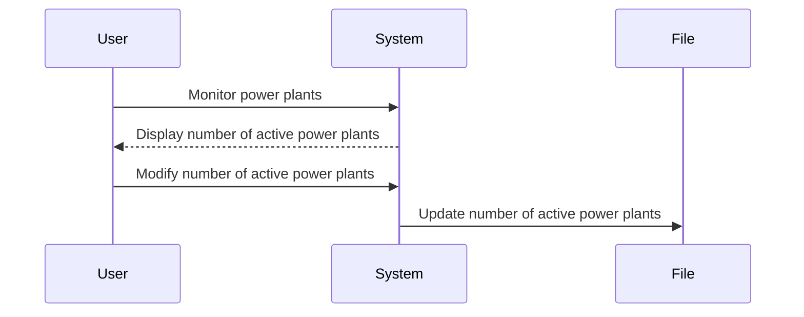
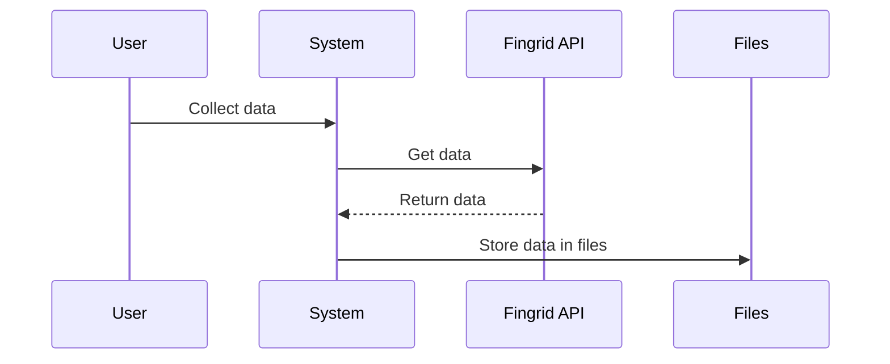
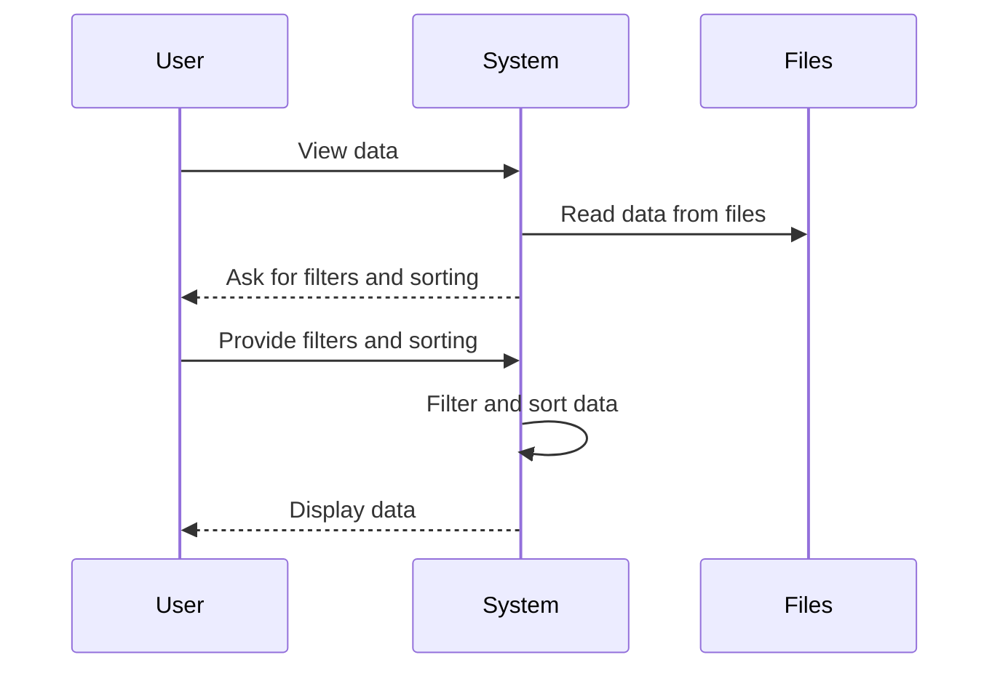
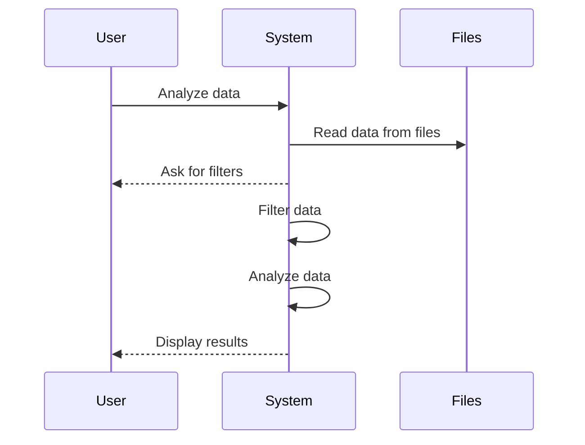
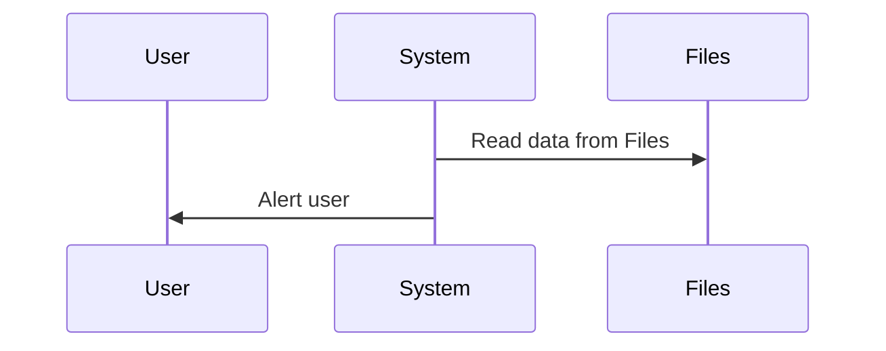
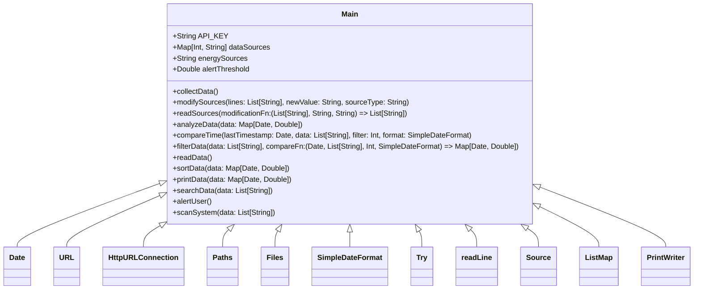

# Renewable Energy Plant System Application

This is a Scala program to simulate a renewable energy plant. 

## Use Cases

The program can be used to simulate the following use cases:

- The system is designed to monitor and control the power plant's renewable energy sources, including wind turbines, hydroelectric power plants, and nuclear power plants. The system can display and modify the number of active power plants.

- The system is capable of collecting data related to the energy generated by renewable sources and storing it in a file.

- The system provides a view of the power plant's energy generation and storage capacity, allowing operators to adjust the power plant's operation as needed. This view shows the data stored in the file.

- The system can analyze the data collected from renewable sources. It can filter the data on an hourly, daily, weekly and monthly basis. It can sort the data where possible. User can search for required data stored in the system. Data Analysis includes:
  - Mean
  - Median
  - Mode
  - Range
  - Midrange

- The system should be able to detect and handle issues with renewable energy sources, such as low energy output, and generating alerts for the operators accordingly.

## Class Diagram

